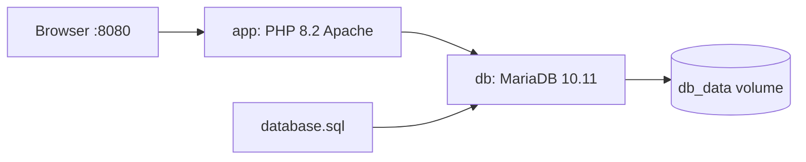

# Panduan Docker — Open Masjid

## Arsitektur



| Service | Image / build | Port host |
|---------|---------------|-----------|
| `app` | `docker/Dockerfile` | `8080` → 80 |
| `db` | `mariadb:10.11` | `3307` → 3306 |

## Alur `docker compose up`

1. **db** — MariaDB start, healthcheck OK, impor `database.sql` (hanya volume baru).
2. **app** — build image, tunggu DB, setup `.env`, `composer install`, `php spark migrate`, Apache ready.

## File terkait

| File | Fungsi |
|------|--------|
| `docker-compose.yml` | Definisi service |
| `docker/Dockerfile` | PHP extensions + Apache |
| `docker/entrypoint.sh` | Bootstrap aplikasi |
| `docker/.env.docker` | Template `.env` untuk container |
| `docker/apache/000-default.conf` | DocumentRoot = root repo (`index.php`) |
| `.env.example` | Override port/password Compose |

## Troubleshooting

### Port 8080 sudah dipakai

Ubah di `.env` root:

```ini
APP_PORT=8888
```

Lalu sesuaikan `app.baseURL` di `app-core/.env` menjadi `http://localhost:8888/`.

### Ingin database bersih

```bash
docker compose down -v
docker compose up --build
```

### Migrasi gagal setelah perubahan skema

```bash
docker compose exec app php /var/www/html/app-core/spark migrate
```

### Akses shell di container

```bash
docker compose exec app bash
```

### Log

```bash
docker compose logs -f app
docker compose logs -f db
```

## Produksi

Setup ini untuk **development lokal**. Untuk production:

- Ganti semua password default
- Set `CI_ENVIRONMENT = production`
- Generate `encryption.key` baru (`php spark key:generate`)
- Nonaktifkan debug toolbar
- Pertimbangkan image terpisah tanpa bind-mount source code
